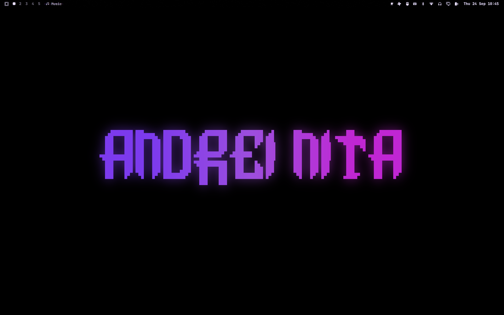
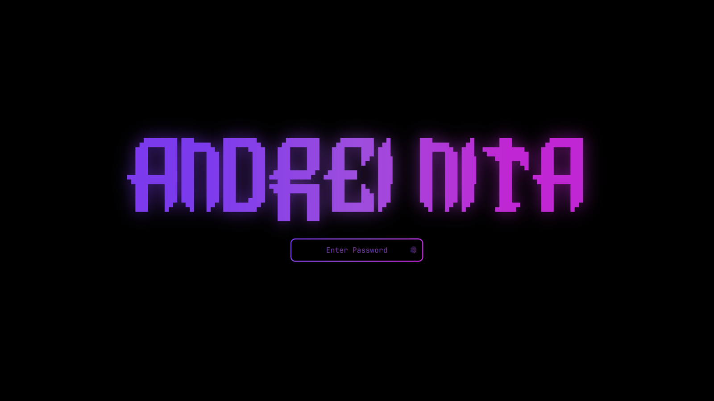
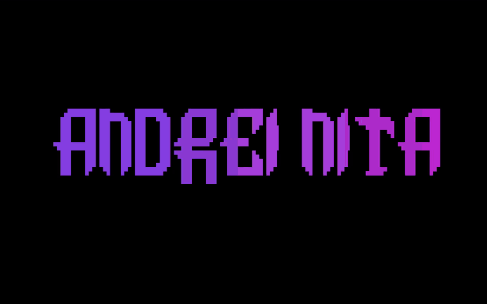
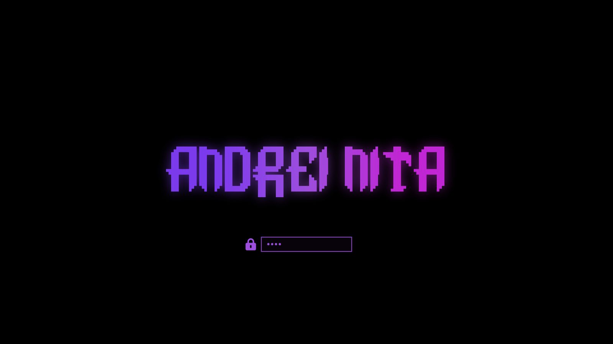
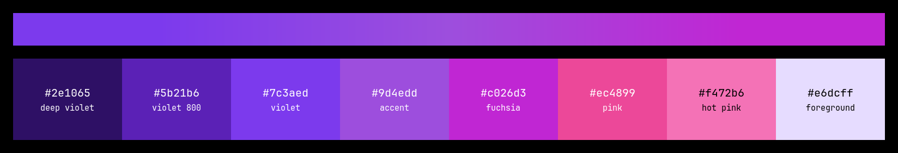

# ANDREI NITA for Omarchy

An OLED-black [Omarchy](https://omarchy.org/) setup built around one piece of
block-letter ASCII art, drawn in a violet → purple → fuchsia gradient. The
same logo shows up on the wallpaper, the lock screen, the screensaver and the
disk-unlock screen at boot.



## What's inside

| Piece | What you get | Folder |
| --- | --- | --- |
| **Theme** | `andrei-nita`: true-black background, gradient window borders, deep purple accents, the logo wallpaper, and Chromium in Chrome's classic purple | [`theme/`](theme/andrei-nita) |
| **Lock screen** | Replaces Omarchy's lock: the glowing logo above a gradient-bordered password field. Password and fingerprint unlock work exactly as before | [`lockscreen/`](lockscreen/andrei.lock) |
| **Screensaver** | Omarchy's animated screensaver showing the logo in purples and pinks, across all 37 effects | [`screensaver/`](screensaver) |
| **Boot screen** | The Plymouth disk-encryption prompt with the same logo and a purple password box | [`boot/`](boot) |

## Lock screen



## Screensaver



A random effect runs each time. Every effect uses the palette below and
finishes on the wallpaper gradient.

## Boot screen



## Palette



The gradient runs from violet `#7c3aed` through purple `#9d4edd` to fuchsia
`#c026d3`. It's the Hyprland `active_border`, so Omarchy carries it into
popups, notifications, menus and password prompts too. `#9d4edd` is the
single accent color.

The accents are deliberately deep. An earlier lilac (`#c9a7ff`) washed out
to nearly white on cheaper panels, so nothing in the accent set is lighter
than hot pink `#f472b6`. The background is pure `#000000`, so on OLED screens
those pixels are simply off.

Body text `#e6dcff` on black is **16.05:1**, well past WCAG AAA. The accent
`#9d4edd` is 4.57:1, enough for the borders, icons and highlights it's used for.

Terminal colors stay distinguishable: red, yellow and green are soft pastels
rather than purples, so `git diff` and compiler errors still read at a glance.

## Install

You need Omarchy 4 (the Quickshell-based shell). The screensaver runs in
Omarchy's screensaver terminal: Alacritty, foot, Ghostty or kitty.

```bash
git clone https://github.com/andreinita21/omarchy-andrei-nita
cd omarchy-andrei-nita
./install.sh          # theme + lock screen + screensaver
./install.sh --boot   # boot screen too (asks for sudo, rebuilds the boot image)
```

| Flag | Installs |
| --- | --- |
| `--theme` | The theme, and applies it |
| `--lock` | The lock screen |
| `--screensaver` | The screensaver text, scripts and idle service, plus a menu override so *System → Screensaver* uses it |
| `--boot` | The Plymouth boot screen |
| `--all` | Everything |

The installer never deletes anything. An existing copy of the theme or a
plugin is moved to `~/.config/omarchy/backups/`, and your old screensaver
text and menu file get `.bak` copies.

To preview the lock screen without locking: `omarchy-shell lock preview`
(click to close). To try the screensaver: `andrei-launch-screensaver force`.

If you have a keybinding that runs `omarchy-launch-screensaver`, point it at
`andrei-launch-screensaver` instead.

## How it works

### Theme

`colors.toml` is the whole theme. Omarchy generates the terminal, btop,
Neovim, browser, keyboard-backlight and shell colors from it with its own
templates. `hyprland_active_border` holds the three-stop gradient.

`chromium.theme` is the exception. Omarchy would seed Chromium from the
background, which here is pure black and gives a black browser. Instead it
uses Chrome's own **Dark purple** preset, `rgb(91, 54, 137)` / `#5b3689`,
the classic purple from Chrome's color picker. Omarchy applies it through
Chromium's `BrowserThemeColor` policy, so Chrome, Brave and Edge pick it up too.

### Lock screen

`andrei.lock` is a clone of Omarchy's `omarchy.lock` plugin. `Service.qml`,
which handles the session lock and the password and fingerprint PAM flows,
is Omarchy's code unchanged. Only `LockView.qml` is restyled.

The logo is `logo.png`, the exact image the wallpaper is made from. Drawing
the block characters as text left thin anti-aliased seams between glyphs, so
the art is pre-rendered with every block snapped to whole pixels.

Because the manifest declares `"clonedFrom": "omarchy.lock"`, enabling the
plugin disables the built-in lock and takes over its IPC target:
`omarchy system lock`, idle lock, lock-before-suspend and your keybinding all
keep working.

### Screensaver

Omarchy's screensaver runs [`ttfx`](https://github.com/ChrisBuilds/terminaltexteffects)
with `--random-effect`, which always uses ttfx's default colors. Colors can
only be set per effect, and the idle service's launch command is hardcoded.
So there are three parts:

- **`andrei-screensaver`** is Omarchy's screensaver loop with a color table
  for all 37 effects: beams, rain, sparks and bubbles in violets, fuchsias and
  pinks, then a left-to-right finish on the wallpaper gradient.
- **`andrei-launch-screensaver`** runs Omarchy's own launcher with one line
  changed, so it starts `andrei-screensaver`. Terminal detection, one window
  per monitor and the screensaver-off toggle all stay Omarchy's.
- **`andrei.idle`** is Omarchy's idle service with a one-line change: it
  starts `andrei-launch-screensaver`.

To limit the random pick to effects you like:

```bash
ANDREI_SCREENSAVER_EFFECTS="beams waves rain" andrei-screensaver
```

### Boot screen

`install.sh --boot` runs Omarchy's own
`omarchy plymouth set '#000000' '#9d4edd' boot/andrei-logo.png`.

## Make it your own

All the images are generated from [`art/ascii.txt`](art/ascii.txt):

```bash
./art/render.sh                                # rebuild with the default gradient
STOPS="#ff0080 #7928ca" ./art/render.sh        # or any gradient you like
```

This rewrites the wallpaper, the theme preview, the lock logo and the boot
logo. It needs `python3` and ImageMagick 7. The art may use `█ ▀ ▄ ▌` and
spaces. If you change the art's size, update the `asciiArt` lines in
`lockscreen/andrei.lock/LockView.qml` too, because the lock uses them to lay
out the logo.

Other places to change colors:

- the theme's `colors.toml`
- `accent`, `accentStops` and `accentGradient` at the top of `LockView.qml`
- the `palette` table in `screensaver/andrei-screensaver`

## Uninstall

```bash
omarchy theme set tokyo-night                  # or any other theme
omarchy plugin remove andrei.lock              # restores Omarchy's lock
omarchy plugin remove andrei.idle              # restores Omarchy's idle service
rm ~/.local/bin/andrei-screensaver ~/.local/bin/andrei-launch-screensaver
omarchy branding screensaver reset             # stock screensaver text
omarchy plymouth reset                         # stock boot screen
```

Also delete the `"system.screensaver"` line from
`~/.config/omarchy/extensions/omarchy-menu.jsonc`.

## License

[MIT](LICENSE) © 2026 Nita Andrei.

The lock screen, idle service and screensaver scripts are adapted from
[Omarchy](https://github.com/basecamp/omarchy), which is also MIT-licensed.
See [NOTICE](NOTICE).
